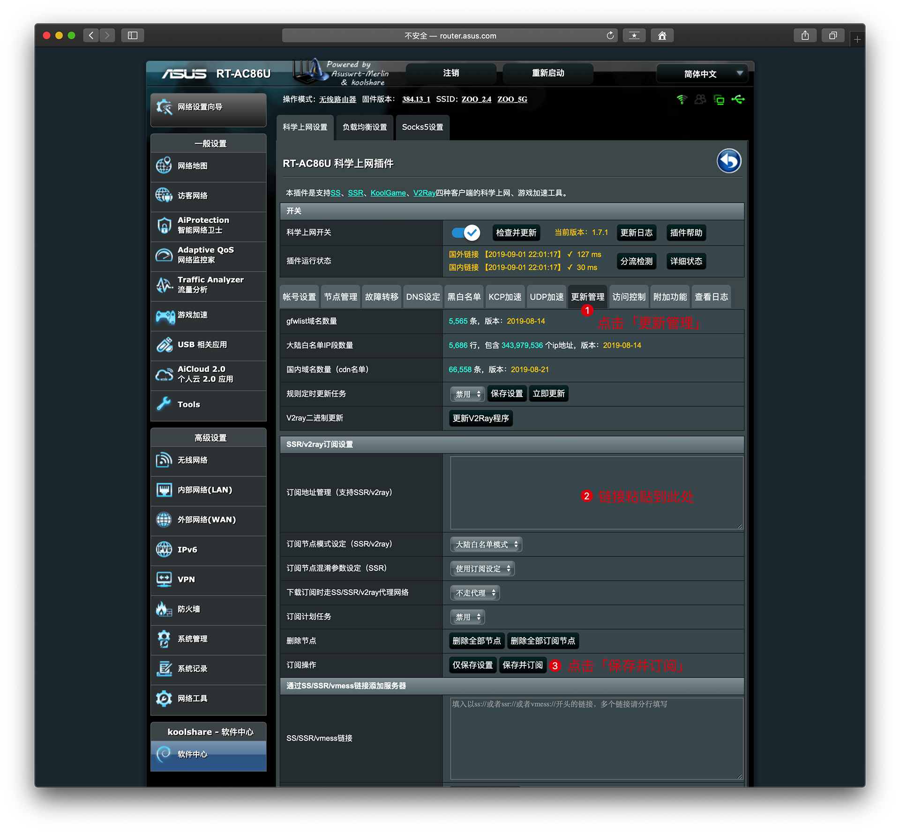

# 华硕RT-AC86U：刷官改/梅林改版系统和挂载虚拟内存教程

### 步骤一、固件下载

- **梅林改版固件**基于梅林固件修改，添加软件中心，有更多的功能和 bug 修复，新版本支持 AiMesh。[点击进入下载页面](https://github.com/masonvip/AC86U-meilin/tree/master/file_meilin)
- **官改固件**基于官方固件修改，添加软件中心，ROG 红色信仰界面，支持 AiMesh，更新较快。[点击进入下载页面](https://github.com/masonvip/AC86U-meilin/tree/master/file_guangai)

 `好用程度，稳定性差别不大，选哪个固件基于个人喜好。固件作者：sadog`

---- 

### 步骤二、升级固件（以梅林改版为例）

* 路由器连接电脑，网页端进入路由器后台；
* 点选【系统管理】-【固件升级】，选择下载好 `.w` 后缀的固件上传。

* 固件升级约 3 分钟。

- 会自动重启，此时刷机完成。
- 进入路由器后台，在【系统管理 】–【 系统设置】内将：`Format JFFS partition at next boot` 和 `Enable JFFS custom scripts and configs` 勾选，然后点击应用本页面，成功后重启路由器。
- 重启后先将路由器连上网络，进入软件中心更新到最新版本（如果有）。

---

### 步骤三、安装科学上网插件

* 科学上网：[插件下载](https://github.com/hq450/fancyss_history_package/tree/master/fancyss_hnd)
* 进入【软件中心】-【离线安装】，选择下载好的文件（后缀名为 `.gz`）上传安装。

* 安装成功后回到【软件中心】，即可看到「科学上网」。

* 点选【科学上网】，添加上网方式，如：`SS`  `SSR` `V2Ray`。

* 订阅机场：点选【更新管理】，把链接粘贴到下图②处，保存并订阅，回到【节点管理】会出现所有节点路线。

---- 

### 安装虚拟内存

随着固件升级越来越完善，基本上可以摆脱虚拟内存，此步可省略；当然也可以选择安装，步骤如下：
* 进入【软件中心】-【未安装】里找到【虚拟内存】并安装。

* 先将 U盘格式为 ext4 格式。方法：[U盘如何格式化为 ext3 ext4 格式][4]
* 将 U盘插到背面 USB（2.0 或 3.0 接口均可）上，进入【软件中心】-【虚拟内存】，会显示 U盘信息。
`如不显示说明 U 盘格式不对，请重新格式化。`
* 虚拟内存大小选择 512 MB 或 1 GB 均可，点选【创建虚拟内存】即可挂载成功。

---
# 路由器「科学上网」设置步骤
## 步骤1
* 打开路由器后台，点击「软件中心」-「科学上网」。

---
## 步骤2
* 点击「更新管理」。
* 把链接粘贴到「订阅地址管理」（下图②处）。
* 然后点击「保存并订阅」。

---
## 步骤3
* 点击「账号设置」，「节点选择」里挑选一个路线。
* 打开科学上网开关。
* 点击「保存&应用」。此时连接路由器的所有设备均可科学上网了。

---
## 友情提醒：
* 如果路线连不上，请在「账号设置」的节点选择里更换其他路线。
* 在「节点管理」里可以看到每一个路线的 Ping 值（一般越低越好）。
