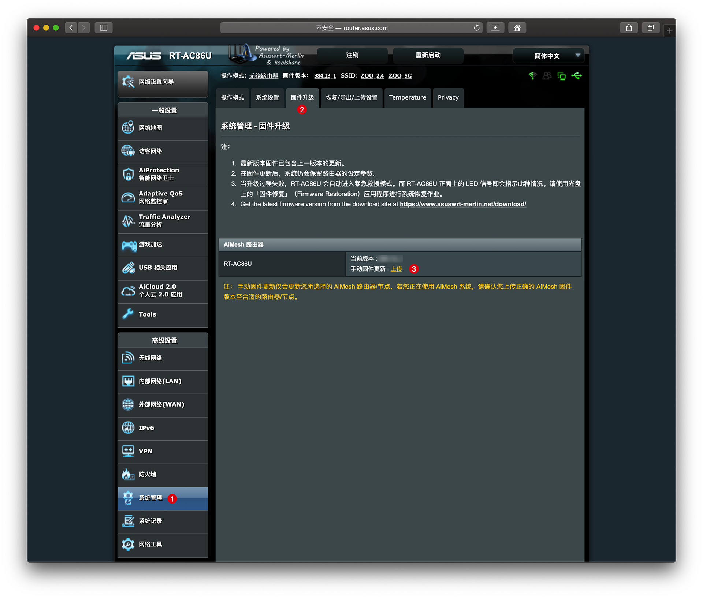
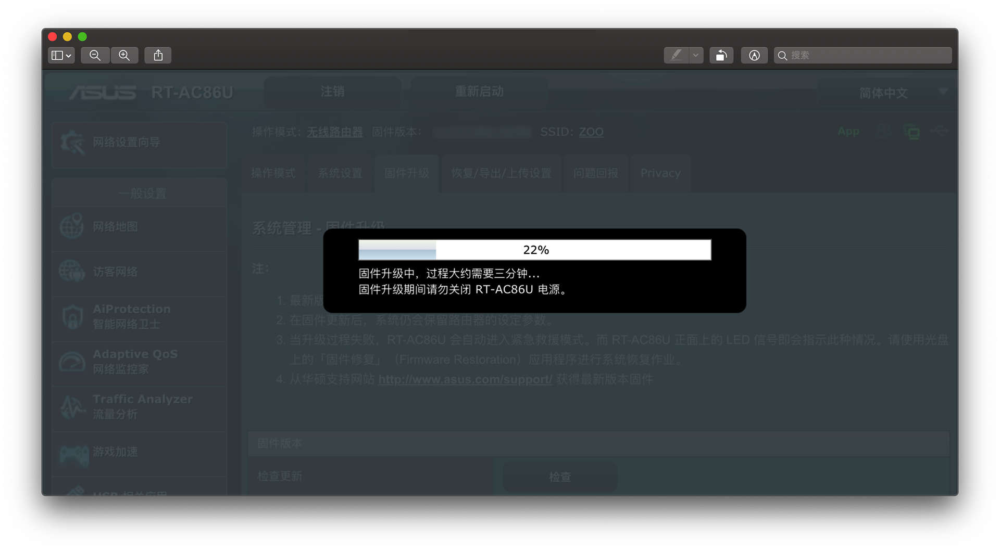
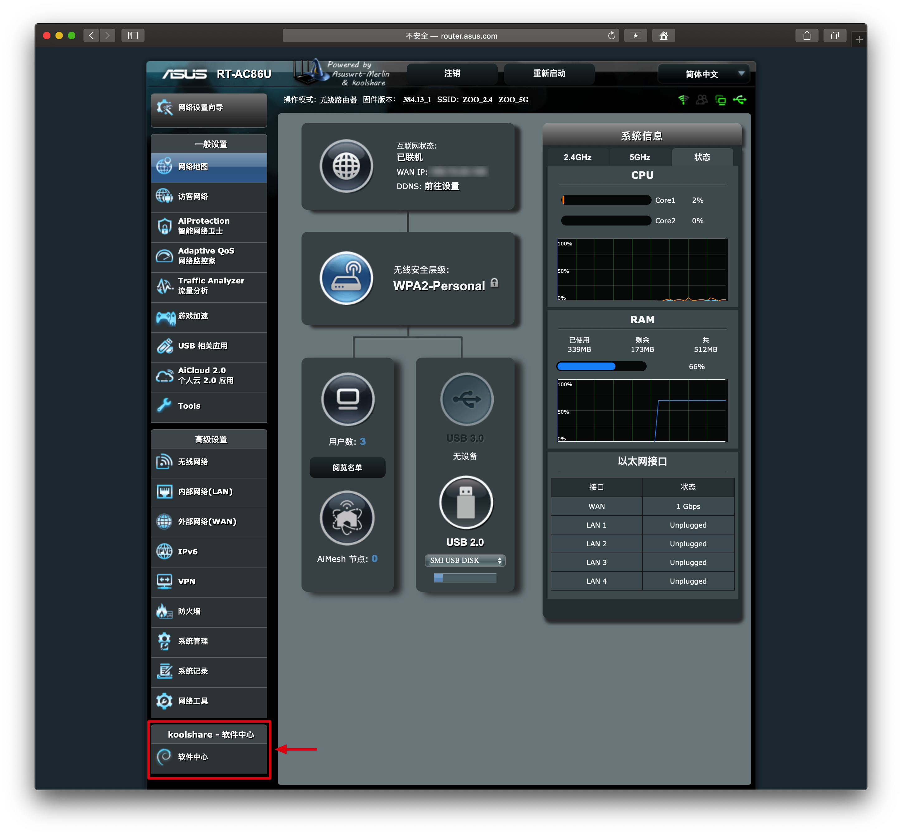
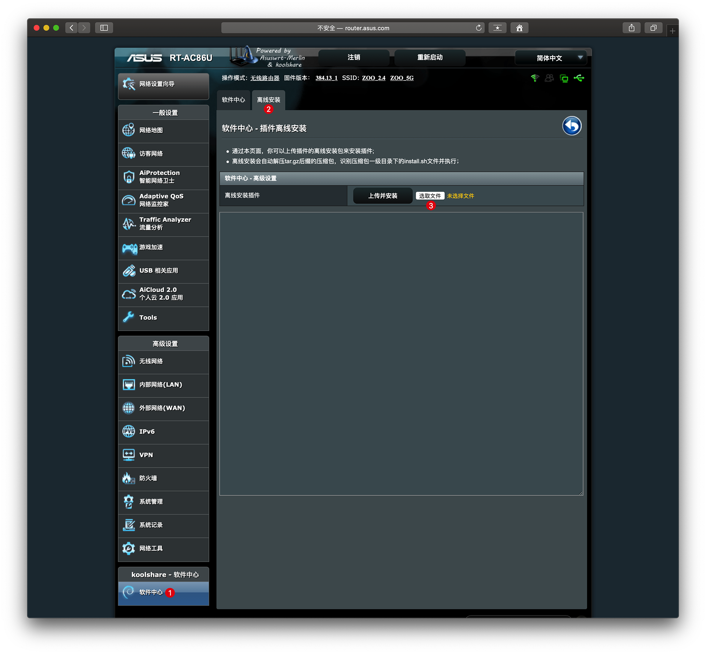
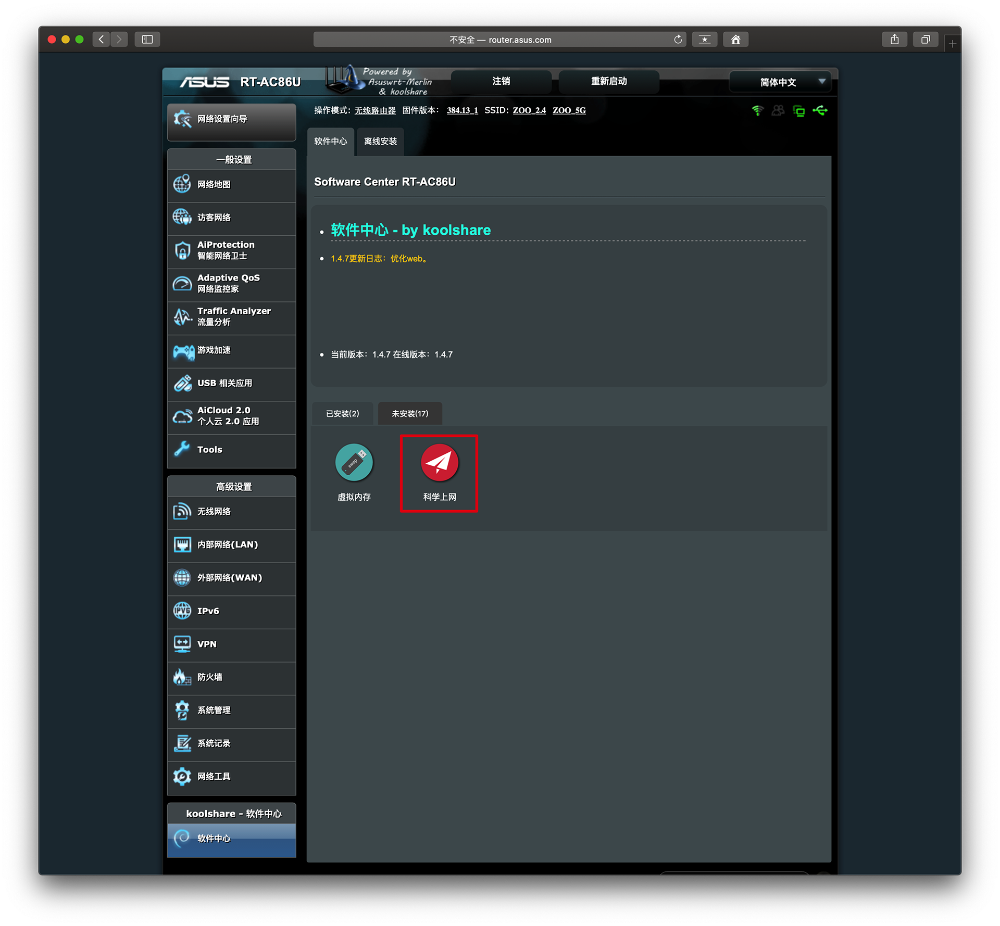
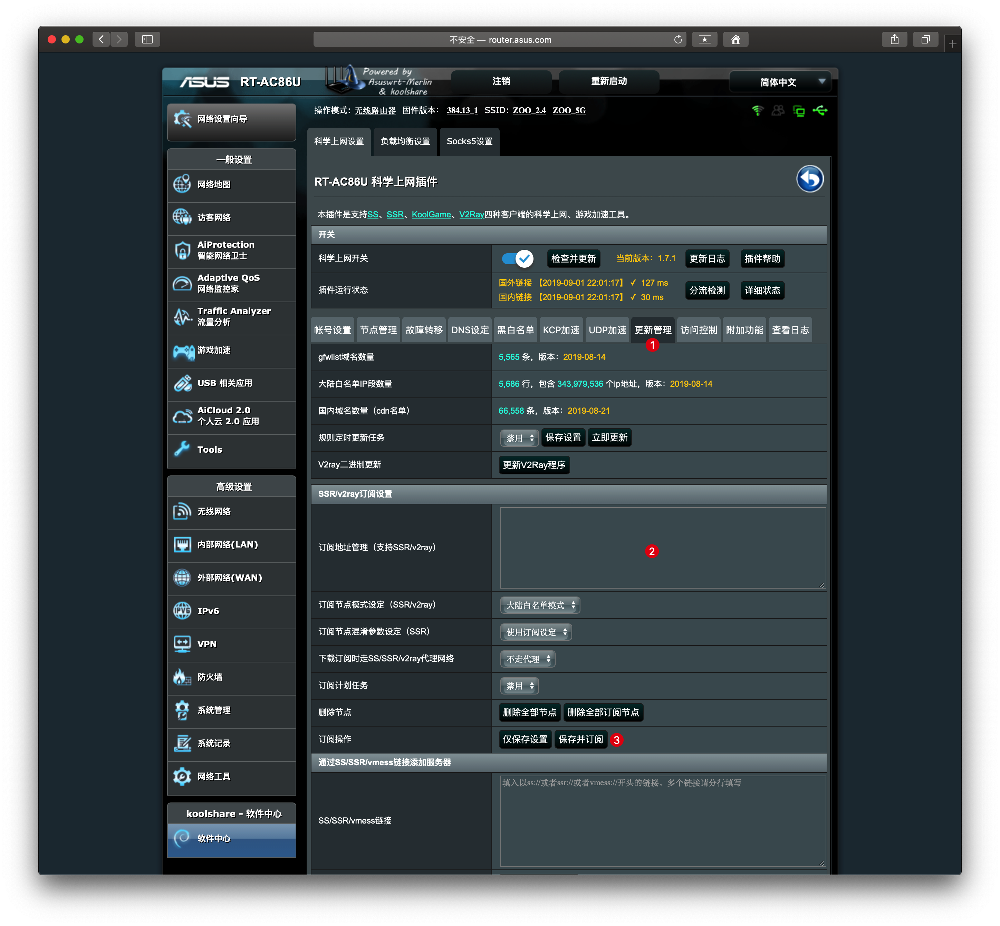
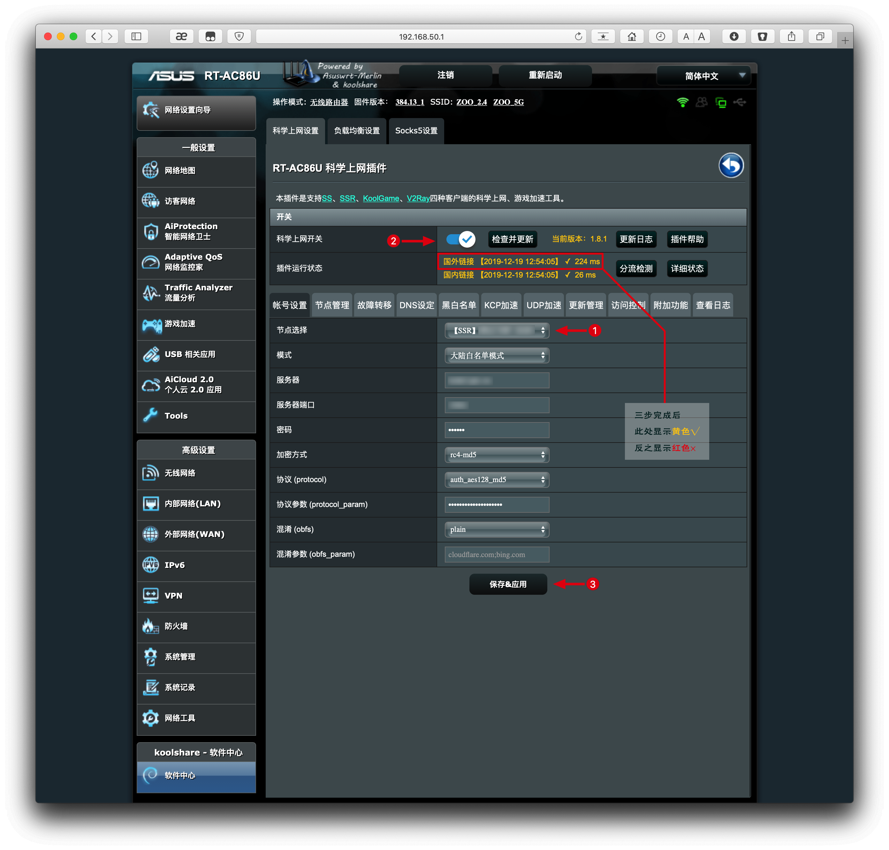

# 华硕RT-AC86U：刷官改/梅林改版系统和挂载虚拟内存教程

### 步骤一、固件下载

- 【梅林改版】基于梅林固件修改，添加软件中心，有更多的功能和 bug 修复，384.13_1 版本开始支持 AiMesh。
- 【官改】基于官方固件修改，添加软件中心，ROG 红色界面，支持 AiMesh。

 `好用程度，稳定性差别不大，选哪个固件基于个人喜好；固件作者：sadog`
 
- 【梅林改版】
- 【官改】

---- 

### 步骤二、升级固件

以梅林改版为例：

* 路由器连接电脑，网页端进入路由器后台；
* 点选【系统管理】-【固件升级】，选择下载好 `.w` 后缀的固件上传。

* 固件升级约 3 分钟。

- 完成后连接网络，可以看到左下角出现【软件中心】。

---

### 步骤三、安装科学上网插件

* 科学上网插件下载：[shadowsocks.tar.gz][3]
* 进入【软件中心】-【离线安装】，选择下载好的文件（后缀名为 `.gz`）上传安装。

* 安装成功后回到【软件中心】，即可看到「科学上网」。

* 点选【科学上网】，添加上网方式，如：`SS`  `SSR` `V2Ray`。

* 订阅机场：点选【更新管理】，把链接粘贴到下图②处，保存并订阅，回到【节点管理】会出现所有节点路线。

---- 

### 安装虚拟内存

随着固件升级越来越完善，基本上可以摆脱虚拟内存，此步可省略；当然也可以选择安装，步骤如下：
* 进入【软件中心】-【未安装】里找到【虚拟内存】并安装。

* 先将 U盘格式为 ext4 格式。方法：[U盘如何格式化为 ext3 ext4 格式][4]
* 将 U盘插到背面 USB（2.0 或 3.0 接口均可）上，进入【软件中心】-【虚拟内存】，会显示 U盘信息。
`如不显示说明 U 盘格式不对，请重新格式化。`
* 虚拟内存大小选择 512 MB 或 1 GB 均可，点选【创建虚拟内存】即可挂载成功。

### 体验：

- 华硕路由器刷机非常简单，直接上传新固件即可完成。
- 现阶段千元内的路由器，不论颜值还是性能都非常优秀。

声明：刷机的朋友认真请阅读本文，带来的风险请自行承担！

友情链接：[AC86U开启SSH，重置软件中心更换皮肤](https://github.com/masonvip/AC86U-pifu/blob/master/README.md)

---

